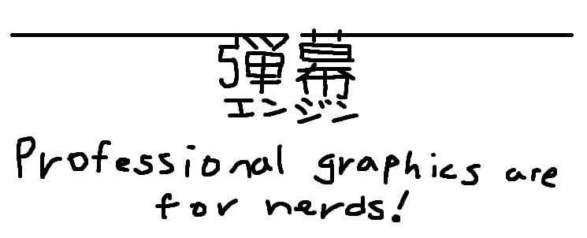

# Danmaku Engine

Danmaku Engine is a plugin for Godot that allows you to create and manipulate bullets for your Touhou clone.
It uses C++ under the bonnet to be as smooth as possible. At the moment the plugin can handle ~6000 simultaneous bullets before it starts to hang (though it can always be more performant and I'm always looking for more ways to squeeze more FPS out of this thing).

I've spent time researching, and much more time playing, great SHMUPs such as Touhou, DoDonPachi and Blue Revolver, and I have tried my best to develop this plugin so that you can create amazing bullet patterns at that level.

<!-- TODO put gif of danmaku engine in action here. -->

## Features
- Bullets! Lots of them!
- A bullet emitter node.
- BulletSettings that you can save and reuse.
- Seeded randomisation for deterministic emitting. #replays

## Setup

To get started, create a `BulletPool` node in your scene and set how many bullets you want the pool to... pool. Make sure you set correctly as the node will never activate more bullets than exists within the pool.

To spawn bullets, you can either do so by first creating a `BulletSettings` resource, then using the `Emitter2D` node to emit bullets for you.

Alternatively, you can do it manually:
```gdscript
var bullet: Bullet2D = pool.get_bullet()
bullet.start(relevant, parameters, go, here)
```

Once a bullet is emitted, it will have the physics layer that you set it to. Add a hitbox to your enemies/player with the matching collision mask, then connect the `body_shape_entered` signal to do whatever you want when something is hit with a bullet.

## Bugs
Probably infinite (although countably infinite). However, the distant screams of Godot running this thing is *not* a bug. It's a feature.

If your game crashes because of this, feel free to let me know, making sure you give me as much juicy detail as possible.

## FAQ
- Q: Will you be making 3D versions of the nodes?
    - A: Since this plugin is what I use when developing SHMUPs, it depends on whether or not I make a 3D SHMUP.

- Q: Can you recommend me a SHMUP to play?
    - A: Play Like Dreamer, or any of Outside's other games!

## Licence
Copyright (c) 2024-present MELMON PROJECT.

This program is released under the MIT Licence. In short, you may use, study and modify the source code in any way your heart desires.
If you use this program in your own project, credit is not required but highly appreciated!

THIS SOFTWARE IS PROVIDED "AS IS" WITH NO WARRANTY OR LIABILITY OF ANY KIND. FOR DETAILS, CHECK THE PROVIDED LICENSE FILE.
